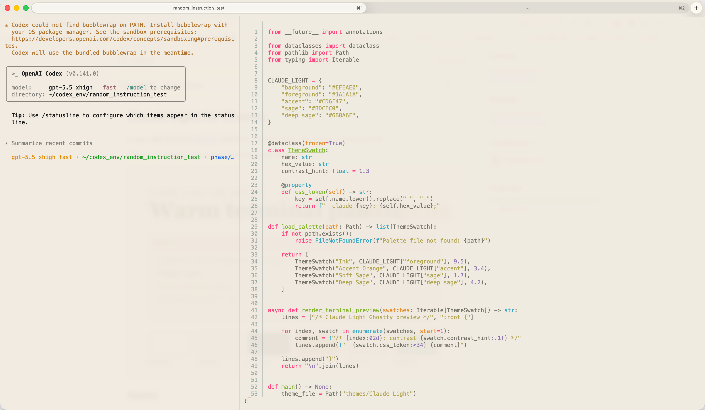

# Claude Light for Ghostty

A warm light theme for [Ghostty](https://ghostty.org/) inspired by Claude's cream, ink, orange, and sage palette.

This is an unofficial theme and is not affiliated with Anthropic.



## Palette

| Role | Hex |
| --- | --- |
| Background | `#FAF9F5` |
| Foreground | `#141413` |
| Accent orange | `#D97757` |
| Anthropic tan | `#D4A27F` |
| Warm gray | `#E8E0D8` |
| Sage | `#788C5D` |
| Directory blue | `#6A9BCC` |
| Bright directory blue | `#8CB6DA` |

## Install

Clone this repository:

```sh
git clone https://github.com/Tonyseth/ghostty-claude-light-theme.git
cd ghostty-claude-light-theme
```

Install the theme:

```sh
mkdir -p "$HOME/.config/ghostty/themes"
cp "themes/Claude Light" "$HOME/.config/ghostty/themes/Claude Light"
```

Then add this to your Ghostty config:

```ini
theme = Claude Light
window-theme = light
minimum-contrast = 1.3
```

On macOS, Ghostty's config is usually:

```text
~/Library/Application Support/com.mitchellh.ghostty/config
```

On Linux and other XDG-style setups, it is usually:

```text
~/.config/ghostty/config
```

Reload Ghostty with `Command + Shift + ,` on macOS, or open a new window.

## Optional Settings

These are not part of the theme, but pair well with it:

```ini
background-opacity = 0.94
background-blur-radius = 16
window-padding-x = 12
window-padding-y = 8
window-padding-balance = true
split-divider-color = #D97757
```

## Tested With

- Ghostty 1.3.1
- macOS

## License

MIT
